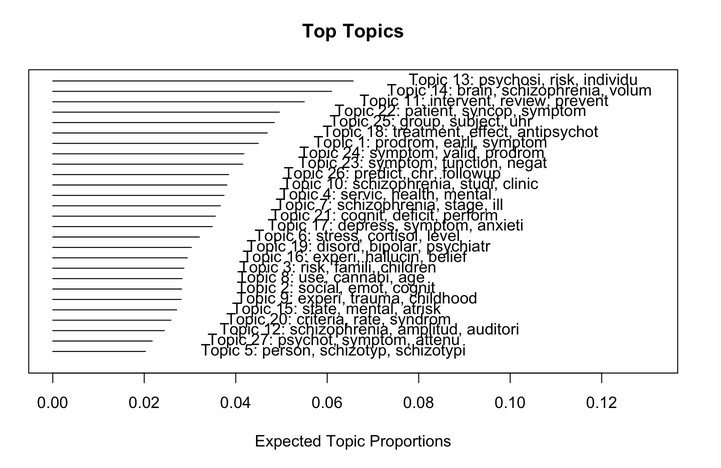

```{r setup, include=FALSE}
knitr::opts_chunk$set(echo = FALSE)
library(ggplot2)
```



머신러닝책을 몇개 보면서 예제를 따라하고, 토픽모델링 관련 프로젝트 하면서 느낀점을 이야기하자면, 사회과학연구에서 특히 경영/교육/인적자원개발에 어떻게 적용해야 하는가는 주요한 질문이며 숙제이다.  기업내부에서는 자원과 적용가능한 데이터의 다양성이 있으므로, 현업에서는 이야기가 좀 다를 수 있다. 토픽모델링이나 머신러닝은 예측의 정확도를 높이는 접근이고, 사회과학 연구에서 알고싶어하는 ‘설명’에 대해서는 그 예측의 정확도와 분석 스펙트럼의 다양성에 비해 많은것을 말해주지는 않는다. 이는 분석의 어프로치, 즉 어떤 질문에 어떻게 답하려고 하는가에 대한 시점이 다르기 때문이 아닐까 한다.

보통  사회학적 연구의 관심은 보통, 왜… 사람들이 이직을 하는가~ 라면, 머신러닝, 또는 예측분석(predict analysis)의 관심은 얼마나 잘 이직자를 구분하는가 라는 것. 예를 들어, 앙상블을 사용해 이직을 예측한다 할때, 이직을 예측할 여러 모델을 앙상블모형으로 구현하고,  모델은 각각의 모형을 스텍으로 쌓아 트레이닝을 통해..모델들의 가중치를 조절한다. 때문에, 한가지 모델에서 예측하는 것보다, 이직을 할 사람을 잘 구분하게 된다. 그런데 데이터의 특성(feature)에 따라 모델들의 가중치가 조절되고 이를 통해 예측결과와 실제의 오류를 줄인다. 현업에서의 활용도는 너무나 당연하지만, 뭔가를 설명하기 위한 연구에서는 어떻게 이걸 활용해야할지 아직까진 감이 잘 안온다. 

토픽모델링은 머신러닝 중 비지도 학습 중 한가지인데, 예를 들어. 토픽모델링을 굳이 왜 하느냐고 다음과 같이 물어본다면, “이전의 군집방법이 뭐가 모잘라서”,  아주 많은 양의 비선형 데이터인 텍스트 데이터를 상대적으로 적은 비용으로(사람, 자원) 그리고 꽤 잘 분류해 주기 때문에 유용하다 라고 말할 수 있지 않을까?

그러나, “이게 왜…어떻게…”와 같은 설명은 어렵다. 분명 모델에서 단어 공출현의 빈도 또는 다른 변수들의 공변인을 추가하긴 하지만, 자료특성과 양에 영향을 많이 받는다.  기본 토픽모델링에서, 모델은 특정 토픽을 구분하는 단어들의 빈도와 분포가 있고 이것을 추정하는데 디리클레 분포에서 특정 토픽분포인 알파를 추정하는것, 그러다보니 토픽평가를 위한 몇가지 지표가 있지만 결국 토픽을 구성하느 단어들과 그 단어들의 양을 보면서 토픽의 이름은 분석가가 정해야 하고, “뭔가…의미는 있는 토픽같은데….이해가 안되는 토픽들도 꽤 많이 나온다.

그러나 이를 통해, 어떻게 베이지 이론이 머신러닝에 근간이 되는지, 그리고 내가 아는 몇몇 통계방법에서 이게 어떻게 작동하는지, 흐릿하게나마 감이 오는 듯 하다(뭐… 해가 내일 동쪽에서 뜰거라는 오늘의 나의 믿음은, 어제 해가 동쪽에서 떳을때의 나의 믿음이 오늘도 해가 동쪽에서 떳기때문에, 내일도 해가 동쪽에서 뜰거라는 나의 믿음이 더 강화된거 겠지…, 그리고 지구가 자전하는 걸 몰라도(모수분포가정)..근데 내일 해가 서쪽에서 뜬다면 내일 나의 믿음은 그 다음날 동쪽에서 뜰거라고 생각하겠지만 오늘만큼 믿지는 않는거). 통계에서는 베이지안 접근의 이점은, 모수적 접근에서 가정하는 제약들에서 자유로워 진다는 것 같은데, 이제 시작이니 걷기전에 뛰려하진 말자. 이런 사상에 부합하는 현상을 수식으로 표현하고 모델링하여 구현하는게 베이지통계들,  베이지 네트워크의 인과추론이 조금 이해간다.