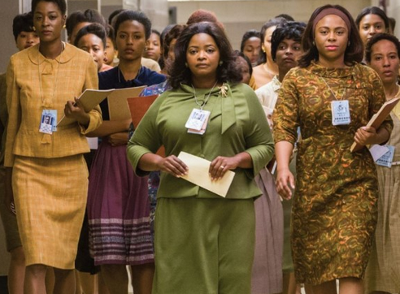

```{r setup, include=FALSE}
knitr::opts_chunk$set(echo = FALSE)
library(ggplot2)
```

# HR Analytics라는게 뭐냐 대체?

이번에 투고한 글의 요지는 그래서 어떻게 HR professional들의 분석역량이라는걸 개발할 것인가? 라는 주제였다. HR Analytics역량에 대한 짧은 글을 쓰고나서 글을 쓰고 나서 몇가지 아쉬웠거나 좋은 글감 아이디어였는데 글 흐름상 제외시킨 몇가지에 대해서 남기려고 함다.

HR Analytics 결국 인적자원분석 이걸 기존의 분석행태와 분리해 보고자 HR Analytics라는 영문이름을 고집했지만 글세 좀 미련한 짓이 아니였나 싶다. 지금 HR analytics 라고 불리우는것이 이전에 없었는가 하면 그건 또 아니고, 이게 브렌딩이 되면서 "HR analytics"라는 브렌드로서 정착되고 있다는 생각이 든다.   

용어가 어찌되었든, 핵심은 데이터와 분석이다. 그리고 분석은 "왜 분석하는가", "뭘 분석하려는가"등의 질문등이 선행되고 나서야 "어떻게 분석할것인가"를 논하는 것이 의미가 있다.

사실 글을 준비하면서 아! 이거다 라는 영감을 준 영화가 있었다. 히든 피겨스 [@hidden].


영화에서 세명의 주요 주인공중에 한명인 도로시 본(나사 흑인여성 최초의 슈퍼바이저, 옥타비아 스펜서 분) ^[포스터에서 세번째 여성, https://www.nasa.gov/content/dorothy-vaughan-biography/]이 나오는 장면은 HR/HRD전문가들이 눈여겨 볼만한 것이 있다. 영화에서 나사는 IBM의 슈퍼컴퓨터를 도입하게 되는데(여기 사용되는 언어가 포트란), 막상 이걸 도입하고도 제대로 운영을 못하고 있는 실정이였다. 도로시는 이 슈퍼컴퓨터의 도입이 자신들을 대체할것을 직감한다. 그녀는 도서관에서 포트란책을 빌려(?) 학습하고, 사람이 없을 때 들어가서 실제도 구동도 해본다. 그녀는 이걸 자신만의 장점으로 숨기지 않고 부서의 다른 직원들에게 새로운 기술(IBM 컴퓨터의 운용, 포트란언어)를 배울것을 동기부여한다. 영화 후반부 비비안 미첼부인이(백인 어드바이져, 슈퍼바이져) 그녀에게 이 부서에서의 일을 제안할 때 비비안은 다른 직원들 모두를 채용할것을 조건으로 제안을 수락한다. 



요즘 4차산업혁명과 관련한 몇가지 글들을 읽으면서 불안과 희망의 혼재를 느낀다. 그런데 한가지 인상에 남는것은 이러한 기술의 발달에서 사람이 도태되는것이 아니라, 새로운 기술을 운용할 역량이 없는 또는 그 준비를 하지 않는 사람들이 도태되는것이라는 주장이다. 히든피겨스에서 IBM컴퓨터의 도입결정 후 컴퓨팅그룹(사람들이 수계산을 하는) 직원들이 토로한 불안과 불만에서 4차산업혁명시대에 대한 사람들의 불안을 매치시켜볼 수 있었다. 자본이론에서 인적자본은 학습과 교육/훈련을 통해 역량과 기술숙련을 높이고 개인의 협상력을 높인다는 주장이 있다(Lin ????). 너무나 당연한 이야기지만 이거다 하는 사례를 꼽기는 어려운 부분이기도 하다. 이는 협상력을 담보할만한 기술역량의 향상이 개인에게 있어서 일반적인 상황에서 쉽지는 않다는걸 의미하기도 하고 빅데이터!!!, 4차산업혁명!!! 으로 대변되는 기술주도의 산업전반의 변환기에서의 일말의 희망일 수도 있겠다는 생각을 해 본다.