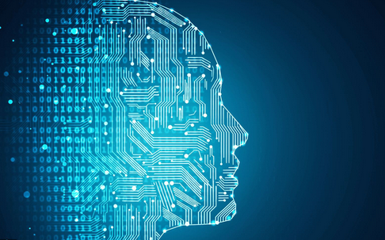

```{r setup, include=FALSE}
knitr::opts_chunk$set(echo = FALSE)
```



2015 년 맥킨지 보고서는 오늘날 근로자의 활동 중 45%가자동화 될 수 있다고 예측하였다. 자동화와 관련한 논의에서, 디지털 트렌스포메이션, 업무자동화, 인공지능과 같은 키워드를 심심치 않게 볼 수 있다.  인공지능의 도입과 디지털 트렌스포메이션의 기저에는 HCI(Human Computer Interaction)과 인지과학에서의 연구와 발견들이 중심을 이루고 있다.

인지과학에서 인지는 세상을 인식하고 경험을 기억하고 이야기하고 배우며 그에 따라 행동을 수정하는 능력에 기초한 정신 과정이며 여기에는 인식, 기억, 언어 및 생각과 같은 기능이 포함된다. 기능주의적 관점에서 인간의 정신에서 발생하는 이벤트들은 정보 또는 출력으로 변환하기 때문에 인과적 또는 기능적이라고 생각해 왔고 마음은 뇌의 소프트웨어이며 독립적으로 이해 될 수 있다고 보았다. 그러나 사회 또는 집단 인지의 측면에서, 개인과 그룹의 정신상태와 행동의 변화는 표현과 상호작용의 변화로 인해 발생하며, 사회적 변화에 대한 설명은 단순히 개개인의 변화의 합계가 아닌 그룹의 출현 속성으로 식별된다고 보았다. 이는 개인차원의 인지가 어떻게 그룹 및 사회차원에서 상호작용을 하는지에 대한 설명으로, 인지 및 사회적 메커니즘으로 인한 사회적 변화는 종종 점진적인 축적이 아니라 중요한 전환으로 인해 발생함을 의미한다. 전통적인 인적자원의 접근에서 인지는 개인의 자격요건, 직무지식 및 핵심역량등에 국한되어 설명이 되었다. 인지기술은 정보를 처리하고 지식을 얻는데 필요한 지각 및 추론과 같은 정신적 능력을 뜻하며 직관력은 대인 관계의 잠재력과 질을 결정하는 인지 기술로 이해되곤 하는데, 이러한 인지적 요소들은 직원들의 작업방식과 능력, 문제해결 및 기획력에 중요한 요소로 이해되었다.

자동화와 관련해서 많은 솔루션 들은 조직에서 일어나는 프로세스와 플로우를 모델링 하고 이를 처리하는 인간의 인지프로세스를 모방하여 복잡한 업무를 안전하게 수행하고 자동화를 촉진하는 것을 목적으로 한다. 그러나, 조직에서 일어나는 모든 프로세스와 플로우를 단일 프로세스로 정의하고 문서화 할 수는 없다. 이는 서로 다른 사람들의 요구사항들을 처리해야하는 (의미를 체계화 하는) 온톨로지에 대한 접근 방식이 필요함을 나타낸다. 온톨로지 상에서 서로 상이한 요구사항들은 메타데이터를 통해 결합되고 분석된다. 이러한 온톨로지는 인지 컴퓨팅 및 엔지니어링을 통해 구현되는데 이는 소프트웨어 개발측면에서 정보 에이전트 및 인지 아키텍쳐를 설계하고 탐구하여 업무 및 작업의 처리에 보다 유연하고 인간적인 지능에 가까운 성능을 개발하는 것을 목표로 한다. 인지기반 솔루션은 이러한 인지프로세스를 기계 또는 시스템에 도입함으로써 인간의 학습과 수행능력을 보강하고 돕기 위해 설계된다. 그러나 인지 솔루션이 인간의 전문 지식을 대체 할 의도가 아님을 분명히해야 한다. 사람과 기계는 각기 다른 방식으로 뛰어난데, 예를 들어 사람들은 상식, 도덕, 상상력, 동정심, 추상화, 딜레마, 꿈꾸는 것, 및 일반화에 뛰어나며, 반면에 인지 시스템은 정보의 저장과 인출 그리고 위치 파악, 패턴 식별, 자연어분석, 기계 학습, 편견 제거 및 반복적 작업수행 능력에 뛰어나다. 

디지털 환경으로 전환되는 일터에서 업무 및 학습 방식의 변화는 선택이 아니라 필수처럼 느껴진다. 이러한 변화를 촉진하는 요인으로는 변화하는 사람들의 요구, 새로운 기술에 대한 시장 압력, 대규모 데이터 과부화등을 들 수 있다. 이것이 HR에 의미하는 것은 무엇일까? HR프로세스와 기능에 대해 인공지능의 역할 논의가 활발하게 진행되는 가운데 컨설턴트인 진 마이스터는 인공지능의 시대에 따른 HR의 10가지 트렌드를 언급하며 HR이 인공지능 시대에 준비해야한다고 주장하였다(1. AI와 인간의 지능을 통한 후보자 경험 향상, 2. 독창적인 인간의 기술의 중요성, 3. 인공지능을 통한 근로자의 성과 향상, 4. 인공지능을 통한 새로운 일자리 창출, 5. 인공지능에 준비된 인력의 중요성, 6. 기술기반 고용, 7. 의미를 위한 거래, 8. 두 가지 직원 혜택 : 자연광(업무환경) 경력 개발, 9.가상현실을 통한 기업교육의 변화, 10. 미래를 준비하는 팀 스포츠). 또한 6,000 명의 경영진을 대상으로 한 IBM의 2017 년 설문 조사에 따르면, HR 임원의 54 %가 인지 컴퓨팅이 HR 의 주요 역할에 영향을 줄 것이라고 답했으며, 조사대상자의 66%에 달하는 CEO들이 인지 컴퓨팅이 HR의 가치를 크게 높일 수 있다고 답헀다. 이는 조사대상자중 절반이상의 HR 경영진이 인지컴퓨팅을 통한 솔루션이 HR의 변화에 핵심임을 인식함을 반증한다. 그러나 모두가 이에 긍정적인 것만은 아닌데, HRPA (Human Resources Professional Association)는 2017 년 설문 조사에 따르면 응답자의 52 %가 향후 5 년간 HR 부서에서 AI를 채택 할 가능성이 낮다고 응답했는데, 채택가능성이 낮다고 응답한 응답자의 36%는 조직 규모,  28 %는 기술의 필요성에 대한 고위 경영진의 인식 때문이라고 답했다. 그러나 어떻게 이런 기술이 산업과 경영전반에 어떤 영향을 줄 것인가, 또는 일터에서의 인간과 시스템이 어떻게 상호작용을 해야할 것인가에 대한 적절한 논의는 아직 찾아보기 힘들다. 이렇듯 인지컴퓨팅, 인지솔루션, AI의 HR도입에 대한 논의는 찬반이 갈리고 있는데 이를 통해 앞으로 HR이 나아가야할 방향과 목표를 다음과 같이 요약해 보았다.
• HR 영향력을 최적화하여 실질적인 ROI에 기반한 의사 결정을 통해 경쟁 우위를 입증.
• 직원 경험을 만들어 인재를 유치, 유지 및 관리하기위한 전략의 수정. 
• 데이터에 기반한 학습 분석과 적응학습을 통해 제시된 학습경로를 활용하는 직원과 리더의 육성.

AI의 도입을 통한 자동화는 반복적이고 부가가치가 낮은 작업을 자동화하여 인간에 의해 수행되어야 할 전략적 업무에 집중할 수 있도록 도울 수 있다. 예를들어, 새로운 직원의 온보딩과정에서 자원의 할당 및 활용을 AI를 통해 처리함으로써 사람에 의해 수행되어야 할 멘토링과 같은 전략적 면대면 업무에 집중할 수 있다. 

아직은 인공지능을 통한 채용이라는 측면에는 부정적인 의견이 많다. 그러나 인지컴퓨팅을 통한 솔루션의 도입은 HR 운영의 복잡한 프로세스를 단순화하며 개인화 된 학습 및 경력 개발을 통해 기존 인재를 강화하거나 조직에 필요한 인재들을 상시 탐지하고 선별하는데 도움을 줄 수 있다. 데이터 중심의 인지 시스템은 인적자원 관리자가 조직에서 철학적으로 맞는 지원자 및 직원의 속성과 특성을 인식하는 것을 돕는다. 이는 인지컴퓨팅솔루션 또는 AI를 통해 기업이 여러 데이터 소스를 활용해 각 사업과 프로젝트에 적합한 인재의 프로파일링을 제시하고 이를 면접에 활용함으로써 인터뷰어의 의사결정을 돕는 솔루션을 생각해 볼 수 있다. 또한 인터뷰 담당자가 인터뷰 과정에서 생기는 질문, 태도, 접근방식등을 수집하여 채용 담당자들을 위한 교육 및 학습에도 활용할 수 있는 계기가 생긴다. 

경력개발의 측면에서도 AI의 도입을 생각해 볼수 있다. 많은 기업들이 직원들에게 동기를 부여하고 참여를 유지하기 위해 내부 이동이나 직무 순환 프로그램을 만드는 것이 중요하다고 인식하고 있다. 개인의 차원에서 조직원들에게 주기적으로 변화하는 조직 내 직무들과 그 직무들에 필요한 역량들을 파악하고 자신의 특성을 가장 잘 살릴 수 있는 경로를 탐색하여 제시하거나 개인이 설계한 경력의 경로를 이루기 위한 역량과 경험 및 교육 경로를 설계하고 추천해주는 시스템이 예라 할 수 있다. 이는 조직의 차원에서 조직내 인력의 배치와 구성, 순환을 효율적으로 관리할 수 있는 계기가 된다.

AI의 도입에 있어 학습은 조직과 학교를 막론하고 가장 넓게, 그리고 적극적으로 수용되고 있는 분야이다. 대표적인 예로 인지기반 인텔리전트 튜토링 시스템을 들 수 있다. 트레이닝에서 학습자의 기술의 숙련도와 지식은 선언적지식의 영역에서 반복학습을 통해 절차적 지식의 영역으로 심화되어간다. 이는 학습곡선을 통해 나타나는데, 반복을 통해 문제해결 시간이 단축되는 비율과 기술감소(Skill decay)의 추정을 가능하게 하였다. 이러한 학습곡선과 기술감소 패턴을 통해 학습자의 학습패턴 분석과 적응학습을 통한 맞춤형 커리큘럼의 제공 그리고 이후 어떤 학습을 하여야할지에 대한 추천시스템을 생각해 볼 수 있다. 

위에 제시한 사례들을 통합적으로 제시하는 솔루션은 아직까지는 요원한 상태이다. 그러나 이를 준비하기 위해 고민해야할 문제들이 있는데 다음과 같다. 

1) 작업수준에서의 HR기능에 대한 분석, 
2) 인간-AI의 협업을 염두에 둔 직무/직능의 설계, 
3) 분석-적용-피드백을 통합하는 프레임.

인공지능으로 대표되는 많은 기술들과 솔루션들은 사람의 인지프로세스를 모방하여 디자인 되었다. 그러나 특정 영역의 직무와 작업은 그 영역의 독특한 작업방식과 철학을 반영하기도 한다. 때문에 이를 충분히 학습하지 못한 인공지능의 도입은 의도와 다른 결과를 가져올 가능성이 있다. 때문에 HR의 기능에서 단순하고 반복적인 업무들에  대한 표준화의 작업과 처리방식에 대한 계획과 디자인이 필요하다. 앞서 밝힌대로 인지기반 솔루션은 인간의 학습과 수행능력을 보강하고 돕기 위해 설계되어야 하며 인간의 전문 지식을 대체 할 의도가 아니다. 때문에 인간이 처리해야 할 업무의 플로우와 자동화를 통해 처리되는 업무사이에의 조율이 필요불가결 하다. 또한 각각의 단일 프로세스의 분석-적용-피드백을 통합하는 프레임의 설계가 선행되어야 한다. 

디지털 환경으로의 전환과 AI, 업무자동화라는 이슈에서 이들이 HR에 의미하는 것은 무엇일까? 이를 답하기 위해 필자는 어떻게 AI가 HR의 기능과 역할에 변화를 가져올 것를 인지과학과 기계학습을 채용이나 경력개발로의 적용을 통해 설명하였다. 인공지능의 성능이라는 것이 아직까지는 고수준의 인지체계를 모방하는 수준까지는 다다르지 못했지만, 특정분야에서 특정 인지프로세스에서는 탁월한 성능을 보여주고 있으며 이를 통한 새로운 비지니스 기회들이 창출되고 있으며, 인적자원관리 및 개발의 측면에서도 인공지능의 도입을 통한 여러가지 긍정적인 측면들에 대한 논의가 시작되고 있는 시점이며 이를 준비해야 한다는 목소리가 나오고 있다. 이 글에서는 AI를 HR에 도입할때의 3가지 목적과 방향들을 제시하고 (1. HR 영향력을 최적화하여 실질적인 ROI에 기반한 의사 결정을 통해 경쟁 우위를 입증, 2) 직원 경험을 만들어 인재를 유치, 유지 및 관리하기위한 전략의 수정, 3) 데이터에 기반한 학습 분석과 적응학습을 통해 제시된 학습경로를 직원과 리더의 육성) 이를 준비하기위한 3가지 필요성을 제시하였다 (1. 작업수준에서의 HR기능에 대한 분석의 필요성, 2) 인간-AI의 협업을 염두에 둔 직무/직능의 디자인, 3) 분석-적용-피드백을 통합하는 프레임의 필요성).
	

		


